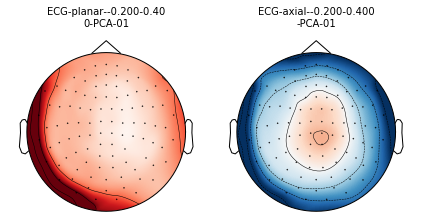
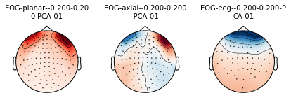
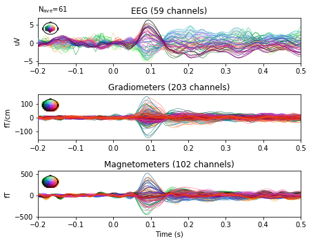
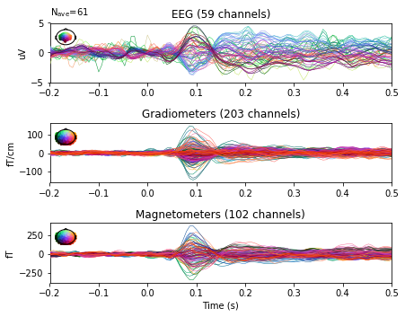
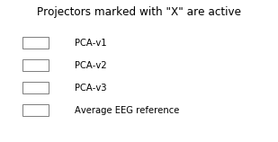
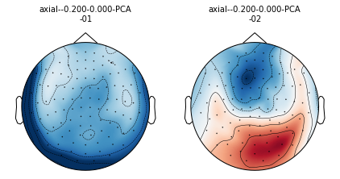

{:.input_area}
```python
%matplotlib inline
```


Signal Space Projection (SSP) Math
---------

We can write the measured signal $b \in \mathbb{R}^{C \times T}$ as

$$ b = b_s + b_n$$

where $b_s\in \mathbb{R}^{C \times T}$ is the brain signals and $b_n(t) \in \mathbb{R}^{C \times T}$ is the noise

Noise $b_n$ can be:
* ambient sensor noise
* electrophysiological corruption
 * cardiac
 * ocular

Now, we can apply PCA on $b_n$ and keep only top $M$ components with loadings $ c_n \in \mathbb{R}^M$:
    
$$ b_n = Uc_n + e_n$$

where $U = [b_1, ..., b_M] \in \mathbb{R}^{C \times M}$ are the orthonormal basis.

Now, the SSP operator $P_{\perp} \in \mathbb{R}^{C \times C}$ is given by:

$$ P_{\perp} = I - UU{^\top} $$

so that:

$$b_s \approx P_{\perp}b$$


Artifact Correction with SSP
============================

This tutorial explains how to estimate Signal Subspace Projectors (SSP)
for correction of ECG and EOG artifacts.


{:.input_area}
```python
import numpy as np

import mne
from mne.datasets import sample
from mne.preprocessing import compute_proj_ecg, compute_proj_eog

# getting some data ready
data_path = sample.data_path()
raw_fname = data_path + '/MEG/sample/sample_audvis_filt-0-40_raw.fif'

raw = mne.io.read_raw_fif(raw_fname, preload=True)
```


{:.output .output_stream}
```
Opening raw data file /home/mainak/Desktop/projects/github_repos/mne-python/examples/MNE-sample-data/MEG/sample/sample_audvis_filt-0-40_raw.fif...
    Read a total of 4 projection items:
        PCA-v1 (1 x 102)  idle
        PCA-v2 (1 x 102)  idle
        PCA-v3 (1 x 102)  idle
        Average EEG reference (1 x 60)  idle
    Range : 6450 ... 48149 =     42.956 ...   320.665 secs
Ready.
Current compensation grade : 0
Reading 0 ... 41699  =      0.000 ...   277.709 secs...

```

We can see that the raw data has projectors computed but not yet applied.


{:.input_area}
```python
print(raw.info['projs'])
```


{:.output .output_stream}
```
[<Projection  |  PCA-v1, active : False, n_channels : 102>, <Projection  |  PCA-v2, active : False, n_channels : 102>, <Projection  |  PCA-v3, active : False, n_channels : 102>, <Projection  |  Average EEG reference, active : False, n_channels : 60>]

```

Exercise
------------

Where did these projectors come from? What was the noise $b_n$?

To interactively explore the effect of applying proj, use `raw.plot()` and click on the "proj" button


{:.input_area}
```python
# raw.plot()
```


Now, we can apply the projectors by doing:


{:.input_area}
```python
raw.apply_proj()
print(raw.info['projs'])
```


{:.output .output_stream}
```
Created an SSP operator (subspace dimension = 4)
4 projection items activated
SSP projectors applied...
[<Projection  |  PCA-v1, active : True, n_channels : 102>, <Projection  |  PCA-v2, active : True, n_channels : 102>, <Projection  |  PCA-v3, active : True, n_channels : 102>, <Projection  |  Average EEG reference, active : True, n_channels : 60>]

```

Compute SSP projections
-----------------------

First let's do ECG.


{:.input_area}
```python
projs, events = compute_proj_ecg(raw, n_grad=1, n_mag=1, n_eeg=0, average=True, verbose=False)
print(projs)

ecg_projs = projs[-2:]
mne.viz.plot_projs_topomap(ecg_projs);
```


{:.output .output_stream}
```
[<Projection  |  PCA-v1, active : True, n_channels : 102>, <Projection  |  PCA-v2, active : True, n_channels : 102>, <Projection  |  PCA-v3, active : True, n_channels : 102>, <Projection  |  Average EEG reference, active : True, n_channels : 60>, <Projection  |  ECG-planar--0.200-0.400-PCA-01, active : False, n_channels : 203>, <Projection  |  ECG-axial--0.200-0.400-PCA-01, active : False, n_channels : 102>]

```


{:.output .output_png}



Now let's do EOG. Here we compute an EEG projector, and need to pass
the measurement info so the topomap coordinates can be created.


{:.input_area}
```python
projs, events = compute_proj_eog(raw, n_grad=1, n_mag=1, n_eeg=1, average=True, verbose=False)
print(projs)

eog_projs = projs[-3:]
mne.viz.plot_projs_topomap(eog_projs, info=raw.info);
```


{:.output .output_stream}
```
[<Projection  |  PCA-v1, active : True, n_channels : 102>, <Projection  |  PCA-v2, active : True, n_channels : 102>, <Projection  |  PCA-v3, active : True, n_channels : 102>, <Projection  |  Average EEG reference, active : True, n_channels : 60>, <Projection  |  EOG-planar--0.200-0.200-PCA-01, active : False, n_channels : 203>, <Projection  |  EOG-axial--0.200-0.200-PCA-01, active : False, n_channels : 102>, <Projection  |  EOG-eeg--0.200-0.200-PCA-01, active : False, n_channels : 59>]

```


{:.output .output_png}



Exercise
-------------
What are we plotting here? Is it the SSP operator?


{:.input_area}
```python
What are we plotting here? Is it the SSP operator
```


{:.output .output_traceback_line}
```

      File "<ipython-input-107-7d516bea2d93>", line 1
        What are we plotting here? Is it the SSP operator
               ^
    SyntaxError: invalid syntax


```

Add SSP projections
---------------------

MNE is handling projections at the level of the info,
so to register them populate the list that you find in the 'proj' field


{:.input_area}
```python
raw.info['projs'] += eog_projs + ecg_projs
# raw.add_proj
```


Now MNE will apply the projs on demand at any later stage,
so watch out for proj parmeters in functions or to it explicitly
with the ``.apply_proj`` method


Demonstrate SSP cleaning on some evoked data
--------------------------------------------


{:.input_area}
```python
events = mne.find_events(raw, stim_channel='STI 014')
reject = dict(grad=4000e-13, mag=4e-12, eog=150e-6)
# this can be highly data dependent
event_id = {'auditory/right': 2}

epochs_no_proj = mne.Epochs(raw, events, event_id, tmin=-0.2, tmax=0.5,
                            proj=False, baseline=(None, 0), reject=reject,
                            verbose=False)
epochs_no_proj.average().plot(spatial_colors=True, time_unit='s');


epochs_proj = mne.Epochs(raw, events, event_id, tmin=-0.2, tmax=0.5, proj=True,
                         baseline=(None, 0), reject=reject, verbose=False)
epochs_proj.average().plot(spatial_colors=True, time_unit='s');
```


{:.output .output_stream}
```
319 events found
Event IDs: [ 1  2  3  4  5 32]

```


{:.output .output_png}



{:.output .output_png}



Interactive topomaps with SSP applied


{:.input_area}
```python
raw = mne.io.read_raw_fif(raw_fname, preload=True)
evoked = mne.Epochs(raw, events, event_id, tmin=-0.2, tmax=0.5,
                    proj='delayed', baseline=(None, 0),
                    reject=reject, verbose=False).average()

# set time instants in seconds (from 50 to 150ms in a step of 10ms)
times = np.arange(0.05, 0.15, 0.01)

fig = evoked.plot_topomap(times, proj='interactive', time_unit='s')
```


{:.output .output_stream}
```
Opening raw data file /home/mainak/Desktop/projects/github_repos/mne-python/examples/MNE-sample-data/MEG/sample/sample_audvis_filt-0-40_raw.fif...
    Read a total of 4 projection items:
        PCA-v1 (1 x 102)  idle
        PCA-v2 (1 x 102)  idle
        PCA-v3 (1 x 102)  idle
        Average EEG reference (1 x 60)  idle
    Range : 6450 ... 48149 =     42.956 ...   320.665 secs
Ready.
Current compensation grade : 0
Reading 0 ... 41699  =      0.000 ...   277.709 secs...

```


{:.output .output_png}


{:.output .output_png}



Now you should see checkboxes. Remove a few SSP and see how the auditory
pattern suddenly drops off


Exercises
---------

1) Can you compute your own proj using empty room data?


{:.input_area}
```python
erm_fname = data_path + 'sample/MEG/ernoise_raw.fif'
mne.compute_proj_raw?
```


2) How would you compute the SSP from the evoked baseline instead of empty room?


{:.input_area}
```python
raw = mne.io.read_raw_fif(raw_fname, preload=True, verbose=False)
reject = dict(grad=4000e-13, mag=4e-12, eog=150e-6)
evoked = mne.Epochs(raw, events, event_id, tmin=-0.2, tmax=0.5,
                    proj='delayed', baseline=(None, 0),
                    reject=reject, verbose=False).average()

projs = mne.compute_proj_evoked(evoked.copy().crop(tmax=0), n_grad=0, n_mag=2, n_eeg=0)
mne.viz.plot_projs_topomap(projs, info=evoked.info);
```


{:.output .output_stream}
```
Adding projection: axial--0.200-0.000-PCA-01
Adding projection: axial--0.200-0.000-PCA-02

```


{:.output .output_png}



Try making `reject=None`. What happens? Why?
